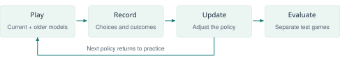
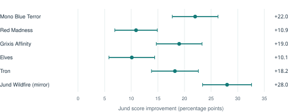

# Teaching a Computer to Play Magic

*Inside the mtg-ml Project*

Project paper · General edition · 10 October 2026

## 1. A familiar game, an unfamiliar learner

A Magic player sees a land, a removal spell, and a creature in hand and immediately starts forming a plan. Which land should come down first? Is it safe to tap out? Should the removal spell be saved for something worse? The mtg-ml project asks whether a computer can develop useful answers by playing large numbers of games, receiving feedback, and gradually changing how it chooses its moves.

The project combines three things: a simulator that enforces the rules, a learning system that practices inside it, and tools that measure and inspect the resulting play. The ambition is to build a stronger player while understanding why it improves, where it fails, and which engineering choices make learning possible. A working opponent is one outcome; a repeatable way to investigate those questions is another.

The setting is Pauper, the Magic format built around cards printed at common rarity. Its card pool is accessible, but its decisions can be demanding. The project currently centers on six decks: Jund Wildfire, Mono Blue Terror, Red Madness, Grixis Affinity, Elves, and Tron. They ask quite different things of a player, from managing sacrifice engines and counterspells to sequencing many small creatures or assembling a powerful mana base. Learning one matchup well is therefore a different achievement from learning to pilot all six decks.

For colleagues unfamiliar with Magic, each player draws from a shuffled deck and spends mana, usually produced by lands, to cast spells. Creatures can attack and block; other spells draw cards, remove threats, or interrupt an opponent. Much of the challenge comes from acting with incomplete information. The opponent's hand and the next cards in either library are usually unknown. A good move must account for several possible futures rather than rely on seeing the actual one.

Even an apparently simple play can contain a lesson. Cleansing Wildfire tries to destroy a land, lets that land's controller search for a basic land, and then draws a card for its caster. Targeting one's own indestructible Bridge can leave the Bridge in place while finding another land. The interaction turns a destruction spell into a way to develop mana and replace the card. Recognizing when to take that line requires more than reading the spell's name.

That example captures the project's appeal: can repeated experience turn legal moves into coherent plans? The results already show measurable learning, but they also show why winning more often against one opponent is only the beginning of an answer.

<!-- pagebreak -->

## 2. Building a game worth learning

Before a learner can practice, it needs a reliable world. The simulator represents the supported cards, the battlefield, hands, libraries, graveyards, mana, combat, and the stack, where spells and abilities wait to resolve, most recently added first. Whenever a player has a choice, the engine provides the available legal options. Casting a spell can lead to separate choices about targets and payment; combat can require choices about attackers, blockers, and damage.

This division is fundamental. The engine supplies the rules and the available moves. The trained agent learns which of those moves to prefer. It does not have to rediscover that an unaffordable spell cannot be cast, and it is not rewarded for inventing illegal actions. Conversely, a legal choice can still be a terrible strategic decision. A learning problem remains even after legality is settled.

The environment also includes the London mulligan, which lets players redraw opening hands at the cost of keeping fewer cards, and best-of-three matches with 15-card sideboards. Sideboarding exchanges cards between games to adapt to the opponent. The normal sideboard policy follows configured plans; this capability should not be confused with an agent having independently learned an optimal sideboarding strategy. Likewise, training on some sideboarded games does not necessarily mean training through complete matches.

Information is restricted to what the acting player is allowed to know. The agent can see its own hand, public cards, and information actually revealed during play. It does not receive the opponent's unrevealed hand or the hidden order of the libraries. Remembering a revealed card is allowed; silently consulting the simulator's complete state is not. The project tests this boundary because accidental extra information would make the apparent playing strength misleading.

Two implementations help balance clarity and speed. Python provides the reference engine, while Rust provides the faster engine used for large training workloads. They are expected to produce identical games from the same seeds and choices. Automated comparisons inspect their decisions and states, alongside targeted card tests and recorded games. Agreement is valuable evidence that the implementations match, although both could still share the same misunderstanding of a rule.

The scope is deliberately bounded. This is a simulator for an implemented card pool and supported deck configurations, not a universal replacement for every Magic rules system. Expanding that scope requires adding interactions and checking them carefully. A rules defect matters twice: it can spoil a game, and it can teach a learner to depend on behavior that would fail at a real table. Building the practice environment is therefore part of the research, rather than a preliminary task that can simply be forgotten.

<!-- pagebreak -->

## 3. What practice looks like for a computer

The learning method is reinforcement learning: the agent takes actions, observes their consequences, and receives feedback from the game outcome. Its policy is a neural network, a collection of adjustable numerical parameters that assigns preferences to the available moves. Training repeatedly changes those parameters so that choices associated with better outcomes become more likely in similar situations.

The signal is sparse. A game may contain many decisions before either player wins, and the winning move may depend on something done several turns earlier. A second output of the network estimates how promising a position is, helping the training procedure connect later results to earlier choices. The system can also use a temporary, fading training signal based on life difference. Neither mechanism supplies a human explanation of the correct play.

Practice includes self-play, where the current model plays both sides, and games against saved older versions. Those older opponents give the learner a changing practice pool and a reason to retain previously useful skills. Scripted bots provide another kind of opponent: their choices follow rules written by developers. They are useful stable tests, but defeating a particular bot may mean learning to exploit its habits rather than mastering the matchup in general.

The model has memory across its own decisions within a game. It receives a representation of the current position and events it could observe, allowing earlier choices and public opponent actions to influence later play. It also receives structured information about cards and short previews of some consequences of its options. These inputs are engineering choices, not knowledge the learner discovered unaided. They help make relationships visible without exposing the opponent's hidden cards.

During normal training, moves are sampled from the model's preferences. A less favored move can still be tried, creating opportunities to discover alternatives. In greedy evaluation, the agent always chooses its highest-ranked option. Testing both distinguishes a policy that plays well while sampling from one that performs well when always taking its first choice.

The models playing these games are dedicated learned policies. They are not chatbots composing a written answer for each turn. Coding assistants help develop the surrounding software, but the game-playing loop runs through the simulator and trained network. That makes it possible to repeat experiments, preserve exact model versions, and investigate the same decision again.

<!-- pagebreak -->

## 4. Progress that can be measured

One completed experiment compared a generalist, `r7-lr075`, with a descendant given three million additional games across Jund's six pairings, `r8-jund-pilot`. Both used the same generation of input features. The question was whether focused practice improved Jund against a range of opponents, including another Jund deck, rather than only against Mono Blue Terror. The fine-tune trained both seats in those pairings; it was not a Jund-only network. [P1]

The chart compares the models as Jund while keeping the opponent fixed as the generalist playing each opposing deck. Each score used 800 sampled games, balancing which player started and which physical seat held Jund. The improved model gained about 18 percentage points on average across the six pairings. Against Mono Blue Terror, its score rose from 40.5% to 62.5%. Draws count as half a win. These are scores against a specified computer opponent, not predictions for a tournament.

The horizontal lines indicate uncertainty from the sampled deals. All six measured improvements were positive even after allowing for that uncertainty. The same comparison using greedy play, with 400 games per score, also improved in every pairing. This supports a concrete conclusion: the selected fine-tune became a better Jund pilot against this reference opponent. It does not establish how much it would improve against every possible opponent.

A separate model, `r8-jund-blue`, concentrated on the Jund-versus-Blue pairing. As Jund against a stronger scripted Blue benchmark bot, its sampled score reached 75.2%, compared with its parent's 46.3%, in a 400-game-per-model test, with uncertainty of roughly five percentage points either way. However, broader checks exposed substantial weaknesses elsewhere. Specialization produced a useful matchup opponent, with a cost to generality. [P1]

The distinction matters for anyone interpreting a headline win rate. The deck, opposing policy, model version, and test conditions all belong with the number. A strong narrow score and a flawed general player can describe the same checkpoint. The project therefore uses several opponents, matchup comparisons, and inspected games rather than treating a single score as proof of mastery.

<!-- pagebreak -->

## 5. The mistakes are part of the result

A human playtest on 10 October supplied a particularly understandable failure. A Tron model reached its second main phase without having played a land that turn. It could pay one mana to use forestcycling, discarding a card to fetch a Forest and make the unused land drop. It repeatedly passed instead. At the flagged decision, it assigned about 92% probability to passing and 8% to forestcycling. The review reconstructed the recorded choices and classified this as a model mistake: the engine had offered the legal action. [P2]

That finding is more useful than saying the opponent played badly. It identifies a specific decision, the available alternative, and the boundary between software behavior and learned strategy. The suggested explanation, that a rarely rewarded action was underlearned, remains a hypothesis. A targeted test or training experiment would be needed to determine the cause. The same review also withdrew another complaint once the sequence of play was examined, illustrating why replay evidence matters.

Players can encounter the models through an invitation-only browser interface. Its replays and feedback flags connect an ordinary game to a reproducible investigation. A player notices something surprising; the recorded state shows what was possible; the model's preferences show what it favored. Individual examples reveal failure modes, while larger evaluations estimate how often a policy wins. Neither type of evidence replaces the other.

Several questions remain open. Can one shared model reliably handle decks with very different plans? Does a larger network help, or would it be better to change which situations it practices? How much can public information about previously seen cards improve decisions later in a match? Work on larger generalists and an experimental belief component was ongoing at the reporting date; these papers do not treat planned outcomes as completed results.

The project has already made those questions testable. It has a playable environment, learned opponents, recorded experiments, and a way to connect a missed land drop to an exact model and game. The next advance may come from better learning, clearer inputs, stronger tests, or repairing an assumption in the simulator. For Magic players, the interesting destination is an opponent whose decisions deserve attention. For colleagues, the project offers a concrete example of how software engineering and experimental evidence must develop together when a system learns from the world it is given.

### Sources and further reading

[P1] mtg-ml. [Experiment ledger: r8 results and Jund matrix](https://github.com/fmssn/mtg-ml/blob/18a3efa3e891b2b4ecddb51db22b615189a71ef5/docs/experiments/ledger.md), 9-10 October 2026. Chart uses `r8-jund-pilot` v01464, evaluated on h100-private, dual Xeon Platinum 8462Y+ CPUs; native engine, no GPU.

[P2] mtg-ml. [Hosted playtest review](https://github.com/fmssn/mtg-ml/blob/18a3efa3e891b2b4ecddb51db22b615189a71ef5/docs/playtest-reviews/2026-10-10.md), 10 October 2026.

[P3] Schulman et al. [Proximal Policy Optimization Algorithms](https://arxiv.org/abs/1707.06347), 2017. The technical companion explains this learning method and the system architecture in more detail.
