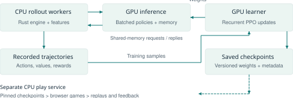

# mtg-ml: Engineering a Self-Play Learning System for Pauper Magic

Project paper · Technical edition · 10 October 2026

## 1. Problem, scope, and research context

**Abstract.** mtg-ml combines a deterministic card-game simulator with recurrent, masked reinforcement learning and reproducible evaluation. It targets six Pauper decks, using a Python reference engine and a matching Rust backend for training throughput. This report describes the feature-set-7, width-256 entity/attention models used in completed generalist and specialist experiments. Focused fine-tuning improves measured Jund play, but broad robustness checks and human replay reviews still expose weaknesses. The contribution described here is an integrated experimental system and its recorded evidence, without a claim of general human-level Magic play. [P]

Magic is a partially observed, sequential, competitive decision problem. The learner acts on its own hand, public objects, and legitimately acquired knowledge; the simulator must also retain hidden hands and library order. A policy maps the permitted observation and its remembered history to a distribution over the legal options at the current decision. Returns ultimately depend on winning, losing, or drawing, while an individual spell may generate several target, payment, and resolution decisions before the next strategic choice.

The implemented setting comprises Jund Wildfire, Mono Blue Terror, Red Madness, Grixis Affinity, Elves, and Tron: 15 cross-deck pairings plus six explicitly selectable mirrors. The rules and card implementations cover a bounded pool, with London mulligans, sideboards, and best-of-three support. The featured r7/r8 recipe mixes isolated preboard and postboard games. Whole-match rollouts and learned sideboard selection should not be inferred from the existence of match support; the usual sideboarding policy applies configured matchup plans.

The learning algorithm is proximal policy optimization, PPO [1]. It changes action probabilities using recorded experience while limiting overly large updates. Generalized advantage estimation, GAE [2], combines outcome information and value estimates to obtain a less noisy training signal. Invalid-action masking [3] supplies the relevant policy-gradient context: mtg-ml scores engine-generated legal candidates and excludes padding from their normalized distribution. The agent learns preferences within that legal set, not the game's legality rules.

AlphaZero [4] provides a reference point for self-play with search in perfect-information games. Magic's hidden information prevents a direct transfer of that setup. ReBeL [5] is relevant background on combining learning and search under imperfect information; its belief-state reasoning and equilibrium guarantees are not properties of mtg-ml's PPO implementation. The current policies do not run an AlphaZero search at every move.

Churchill, Biderman, and Herrick [6] establish undecidability through particular Magic constructions. That result motivates care when discussing the full game's complexity, but does not establish that the project's fixed card pool and bounded episodes are undecidable, nor that reinforcement learning is uniquely required. The practical research question is narrower: which representations, opponent distributions, and training systems yield stronger decisions within a precisely described environment?

<!-- pagebreak -->

## 2. Simulator and information contract

The Python engine is the behavioral reference. Its Rust port is exposed to Python through PyO3 and maturin, allowing the same training and evaluation interfaces to select either backend. Both consume a shared declarative card specification. The intended contract is stronger than approximately similar win rates: equal seeds and action sequences must produce matching decisions, option keys, views, features, and game state. A native extension belongs to the checkout whose Rust code built it, avoiding silent evaluation against another worktree's engine.

Decision objects separate rule execution from agent choice. Their kinds cover priority, targets, mana payment, card selection, ordering, and combat. Stable option descriptors allow feature extraction without treating transient object identifiers as strategic identities. Feasibility checks prevent offering a spell whose costs cannot be completed, while canonicalization removes equivalent choices. These mechanisms reduce redundant action paths but do not remove strategically poor legal actions. A correct action set is necessary for meaningful policy learning.

The distinction is visible in Cleansing Wildfire. Its destruction attempt does not destroy an indestructible Bridge, yet the remaining effects can still find a basic land for the target's controller and draw for the caster. The engine must encode those consequences accurately. The policy then decides whether that resource-development line is preferable to another play in the current position. Hard-coding the rule interaction and learning when to use it are separate responsibilities.

The observation boundary is equally important. Player views include public zones, the acting player's hand, and information revealed to that player. They exclude unrevealed opponent cards and unknown library order. Knowledge of library positions can be acquired and lost, including through shuffling. Event features expose public opponent actions but suppress private details of choices that could name hidden cards. Tests vary hidden states while checking that permitted observations and features remain unchanged.

Feature set 7 removes explicit archetype labels and absolute seat identity, exposes the player's registered and current deck counts, retains all entities, and provides previews for every candidate. Earlier checkpoints keep their recorded feature version. Consequently, architecture compatibility alone is insufficient to reproduce a result: changing the encoder can alter what the network knows even when tensor dimensions still fit. Feature versions are part of checkpoint provenance, not simply a preprocessing preference.

Simulated option previews apply a candidate to a copied state and summarize observable consequences until continuation requires hidden information or an opponent choice. A separate preview explores the assumption that the opponent passes. These are supplied features with explicitly constrained semantics, not a minimax search, proof of an optimal line, or access to the actual hidden future. Their correctness and information boundary need testing as carefully as the ordinary observation.

Validation combines exact-position rules tests, random-game invariants, recorded golden traces, and differential games comparing the Python and Rust engines step by step. Deterministic reconstruction also permits inspection of a reported human-play failure. These checks catch regressions and disagreement; they do not independently certify all card rules. Shared specifications and similar implementations can carry the same error, so trace review and rules-level scrutiny remain necessary alongside engine parity.

<!-- pagebreak -->

## 3. Representation and learning

The featured family uses feature set 7, an entity trunk of width 256, one entity self-attention layer, GRU memory, and a shared value head. This is the configuration inherited from the `r7-lr075` generalist by the selected r8 fine-tunes. It differs from generic trainer defaults at this revision, which specify width 512, an MLP trunk, no entity attention, and a separate value network. Describing the defaults as the experimental architecture would therefore misidentify the models being evaluated.

State and option strings are hashed into fixed embedding spaces. Entity features describe cards and other objects, including card properties and relations; the acting player's hand is represented as entities too. The entity trunk embeds these objects, applies attention across them, and combines their information with global state features. Attention allows object representations to depend on other objects in the position. Options can reference relevant entity vectors, helping their scores depend on the cards they actually concern.

A gated recurrent unit, GRU, processes the player's decision sequence. It receives the current state representation and observable events since that player's previous decision. The recurrent output combines with the state representation to form a policy core. Each candidate has an option embedding; a scorer combines it with the core and their elementwise interaction to produce a logit. Softmax normalizes legal logits, with padded slots masked to negative infinity. A linear value head predicts the position's return from the same core.

Recorded trajectories contain actions, their behavior-policy log probabilities, value estimates, and rewards. Terminal rewards are +1 for a win, -1 for a loss, and 0 for a draw; optional life-difference potential shaping fades according to its configured schedule. GAE produces advantages, estimates of how much better an action's continuation was than the value baseline [2]. PPO's clipped probability-ratio objective discourages excessively large changes from the policy that generated the data [1]. Value fitting and an entropy term accompany the policy objective.

Recurrent training replays whole player trajectories from their starts using current weights rather than treating stored hidden states as fixed training inputs. Minibatches therefore group trajectories, with a target decision count rather than arbitrary independent rows. The featured fine-tunes use four PPO epochs, a target minibatch size of 2,048 decisions, and a KL-divergence stopping threshold of 0.03. KL measures distributional change, offering an additional check on update size; it does not guarantee strategic improvement.

The completed r8 runs mix 50% current self-play with 50% games against frozen snapshots. Half of pool selections favor the most recent snapshot and the remainder sample uniformly. They use 20% postboard games. The Jund-versus-Blue specialist receives six million additional games in that pairing; the Jund pilot receives three million across six equally weighted Jund pairings. Both seats participate in those pairings. These choices change the training distribution, so specialization gains cannot be attributed to architecture alone.

Feature set 8 adds an experimental belief head trained from witnessed opponent-card evidence, including evidence across a match. Its predictions are passed to the policy through a detached projection: PPO gradients do not train that branch, which has its own supervised loss. This opt-in extension requires its own evaluation and is not part of the completed feature-set-7 comparisons reported here.

<!-- pagebreak -->

## 4. Training infrastructure and deployed play

CPU worker processes run the native engine, construct features, and keep multiple games active. The recorded r8 launcher assigns 24 rollout workers and separate learner and inference GPUs on H100 hosts. In server mode they send batches through shared memory; ordinary decision traffic avoids Python object serialization. A GPU inference process batches requests across workers and compatible policies, returns sampled actions, log probabilities, and values, and keeps recurrent states indexed by game and seat. Policy weights can be stacked for grouped computation, using Triton kernels and CUDA graphs to reduce repeated launch overhead.

The learner consumes recorded trajectories and publishes updated policy versions. CUDA-graph PPO captures repeated update work; selected dense and attention operations can use BF16 while probability and optimizer calculations retain FP32. Collection can overlap updates, introducing a one-iteration policy lag. Performance therefore depends on simulation, feature construction, transport, inference, and optimization together. Engine-only decisions per second should not be presented as end-to-end training throughput.

| Recorded r8 setting | Value |
|---|---|
| Architecture / inputs | Entity + attention + GRU; width 256; feature set 7 |
| Batch / update | 2,048 games per iteration; 4 PPO epochs |
| PPO minibatch / KL stop | Target 2,048 decisions; 0.03 |
| Learning rate | Linear 7.5e-5 to 7.5e-6 over the run |
| Opponents / postboard | 50% self-play, 50% snapshot pool; 20% postboard |
| Compute path | Rust CPU workers; GPU inference and learner; BF16 PPO |

Table 1 describes the completed r8 recipe [P], not command-line defaults. Exact launch flags, source revisions, checkpoint hashes, metrics, and archived evaluation reports make an experiment identifiable. In particular, the reported Jund matrix uses pilot policy v01464; the archive's default `policy.pt` points to the later v01465. Using a convenient filename without checking its identity would change the experiment.

Hosted play uses a separate CPU deployment: a containerized Python application with the native engine, pinned model files, SQLite state, and replay files. Cloudflare Access and an outbound tunnel front the Hetzner host; the application also checks the access token and player allowlist. Checkpoint hashes are verified at startup. This service supports reproducible human feedback without putting the training machine in the interactive request path.

<!-- pagebreak -->

## 5. Evaluation, findings, and limits

The completed Jund matrix holds `r7-lr075` fixed as the opponent on each deck and compares it with `r8-jund-pilot` v01464 as Jund. Each sampled cell contains 800 games: 200 deal seeds, crossed with starting player and physical seat. Greedy cells use 400 games. Draws score one half. Improvements are paired by seed, treating each four-game block as a unit; the reported intervals are normal 95% intervals on block differences. Cell intervals in the ledger are Wilson summaries, not a replacement for that paired analysis. [P]

The pilot gains 18.0 percentage points on average across six sampled pairings, all with paired intervals above zero. Against Blue, scores are 62.5% versus 40.5%, a +22.0-point difference with paired 95% interval [17.7, 26.3]. Greedy gains average 13.8 points. Evaluation ran on h100-private, dual Xeon Platinum 8462Y+ CPUs, native engine, eight workers, no GPU. These are conditional comparisons against the parent lineage, without demonstrated generalization to arbitrary opponents.

A separate 400-game-per-cell scripted-specialist test gives `r8-jund-blue` 75.2% sampled as Jund against the Blue specialist, versus 46.3% for its parent; greedy scores are 79.0% and 49.0%. The ledger's per-cell Wilson 95% intervals extend roughly five percentage points either side. Broad trust checks still fail overall for both the generalist and the two tested r8 fine-tunes. Internal L1 Elo summarizes comparisons on a fixed checkpoint ladder; it is neither a human rating nor a proof against exploitation. Snapshot tests likewise probe vulnerabilities without computing formal game-theoretic exploitability.

The documented Tron playtest missed a legal forestcycling route to an unused land drop [Q]. It establishes a concrete policy failure, not its learning cause. Larger generalists and belief-head experiments were ongoing at the cutoff. Separating capacity limits, data allocation, and interference needs further controlled evidence. The present result is measurable specialized improvement with unresolved general robustness.

### References

[1] Schulman, J., et al. (2017). [Proximal Policy Optimization Algorithms](https://arxiv.org/abs/1707.06347). arXiv:1707.06347.

[2] Schulman, J., et al. (2015; ICLR 2016). [High-Dimensional Continuous Control Using Generalized Advantage Estimation](https://arxiv.org/abs/1506.02438). arXiv:1506.02438.

[3] Huang, S., and Ontañón, S. (2022; preprint 2020). [A Closer Look at Invalid Action Masking in Policy Gradient Algorithms](https://arxiv.org/abs/2006.14171). FLAIRS 35.

[4] Silver, D., et al. (2017). [Mastering Chess and Shogi by Self-Play with a General Reinforcement Learning Algorithm](https://arxiv.org/abs/1712.01815). arXiv:1712.01815.

[5] Brown, N., et al. (2020). [Combining Deep Reinforcement Learning and Search for Imperfect-Information Games](https://arxiv.org/abs/2007.13544). NeurIPS 33.

[6] Churchill, A., Biderman, S., and Herrick, A. (2019). [Magic: The Gathering is Turing Complete](https://arxiv.org/abs/1904.09828). arXiv:1904.09828.

[P] mtg-ml. [Experiment ledger](https://github.com/fmssn/mtg-ml/blob/18a3efa3e891b2b4ecddb51db22b615189a71ef5/docs/experiments/ledger.md), r7/r8 entries, 8-10 October 2026. Source snapshot: `18a3efa`; detailed provenance accompanies these papers.

[Q] mtg-ml. [Hosted playtest review](https://github.com/fmssn/mtg-ml/blob/18a3efa3e891b2b4ecddb51db22b615189a71ef5/docs/playtest-reviews/2026-10-10.md), 10 October 2026.
